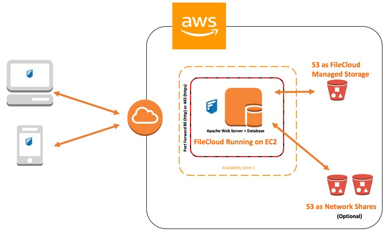

# Disaster Recovery In Cloud Computing
## Using AWS S3 Buckets



### installing dependencies and AWS command line interface:
```python
sudo apt-get install python3.7
alias python=python3
sudo apt-get install python3-pip
sudo pip3 install awscli
sudo pip3 install boto3
aws configure
```

```
>> AWS Access Key ID [****************A]:
>> AWS Secret Access Key [****************0]:
>> Default region name [eu-west-1]:
>> Default output format [json]:
```
create file `touch test.py`


## Python files
- create_bucket.py
```python
import logging
import boto3
from botocore.exceptions import ClientError

def create_bucket(bucket_name, region=None):
    """Create an S3 bucket in a specified region

    If a region is not specified, the bucket is created in the S3 default
    region (us-east-1).

    :param bucket_name: Bucket to create
    :param region: String region to create bucket in, e.g., 'us-west-2'
    :return: True if bucket created, else False
    """

    # Create bucket
    try:
        if region is None:
            s3_client = boto3.client('s3')
            s3_client.create_bucket(Bucket=bucket_name)
        else:
            s3_client = boto3.client('s3', region_name=region)
            location = {'LocationConstraint': region}
            s3_client.create_bucket(Bucket=bucket_name,
                                    CreateBucketConfiguration=location)
    except ClientError as e:
        logging.error(e)
        return False

create_bucket("eng89ron", "eu-west-1")

print("Bucket was created")

```

- upload.py
```python
import logging
import boto3
from botocore.exceptions import ClientError


def upload_file(file_name, bucket, object_name=None):
    """Upload a file to an S3 bucket

    :param file_name: File to upload
    :param bucket: Bucket to upload to
    :param object_name: S3 object name. If not specified then file_name is used
    :return: True if file was uploaded, else False
    """

    # If S3 object_name was not specified, use file_name
    if object_name is None:
        object_name = file_name

    # Upload the file
    s3_client = boto3.client('s3')
    try:
        response = s3_client.upload_file(file_name, bucket, object_name)
    except ClientError as e:
        logging.error(e)
        return False
    return True

x = input("File name: ")
upload_file(x, "eng89ron")

print("File was uploaded")
```

- download.py
```python
import boto3

s3 = boto3.client('s3')
s3.download_file('eng89ron', 'test.txt', 'test2.txt')

print("File downloaded")
```

- delete_file.py
```python
import boto3

s3 = boto3.resource('s3')
s3.Object('eng89ron', 'test.txt').delete()

print("File deleted")
```

- delete_bucket.py
```python
import boto3

s3 = boto3.client('s3')
bucket = 'eng89ron'
response = s3.delete_bucket(Bucket=bucket)

print("Bucket deleted")
```
